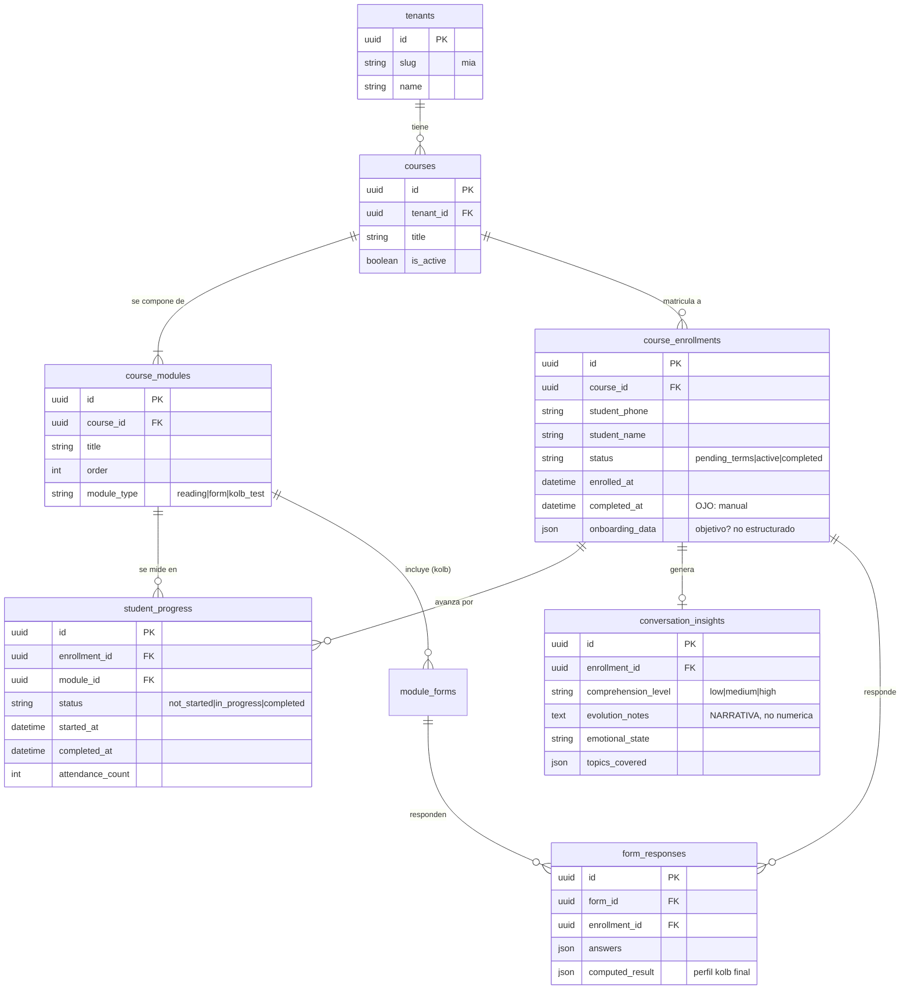

# Pregunta uno — Diagrama ERD para el taller

## La pregunta de negocio

> **"De los coachees que iniciaron el programa con MIA, ¿cómo va el avance de cada uno?"**

## Entidades que necesitamos (paso 2 del método)

| Necesitamos saber... | Entidad |
|----------------------|---------|
| Quién es el coachee | `course_enrollment` |
| En qué programa está inscrito | `course` |
| Cuáles módulos tiene el programa | `course_module` |
| Por qué módulos ha pasado y cuándo | `student_progress` |
| Cómo ha sido la conversación | `conversation_insight` |
| Si hizo el test de perfil (Kolb) | `form_response` |

## ERD — solo lo que la pregunta requiere (Mermaid)



## Mapa visual para Excalidraw

Si lo dibujas a mano, usa este layout (cajas y conexiones):

```
                    +---------+
                    | tenants |  <-- filtrar por slug='mia'
                    +----+----+
                         |
                         v
                    +---------+
                    | courses |
                    +----+----+
                         |
            +------------+------------+
            v                         v
     +----------------+        +-----------------+
     | course_modules |        | course_enroll.. |
     +-------+--------+        +--------+--------+
             |                          |
             |                          +-------+------+
             |                          v              v
             |                  +---------------+  +----------------+
             +----------------> | student_      |  | conversation_  |
             |                  | progress      |  | insights       |
             |                  +---------------+  +----------------+
             |                                            |
             v                                            |   <-- AQUI vive
     +--------------+                                     |       el "avance"
     | module_forms |                                     |       pero como
     +------+-------+                                     |       NARRATIVA
            |                                             v
            v                                  ........................
     +----------------+                        : ¿Avance NUMÉRICO 1-10? :
     | form_responses |                        :  NO existe estructura :
     | (kolb_test)    |                        :  DECISION DE DISENO   :
     +----------------+                        ........................
```

## Las dos zonas del diagrama

**ZONA VERDE — la BD responde con elegancia:**
- Inscripción y matrícula → `course_enrollments`
- Progreso por módulo con timestamps → `student_progress`
- Perfil Kolb completo → `form_responses` con `computed_result`
- Nivel narrativo de comprensión → `conversation_insights`

**ZONA AMARILLA — decisión de diseño (NO gap):**
- `conversation_insights.evolution_notes` es texto enriquecido, no KPI numérico
- `course_enrollments.completed_at` se setea por proceso, no por trigger automático
- `onboarding_data` es JSON libre, no schema de "objetivo declarado"

Esto es lo que abres con el cliente: **¿quieren convertir narrativa en KPI? Eso es debate de producto, no falla técnica.**
